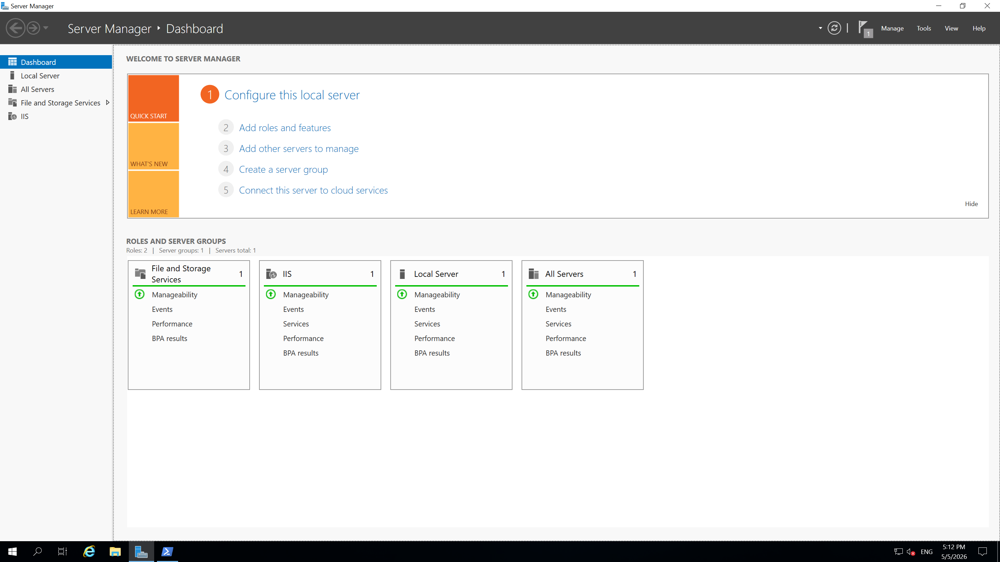
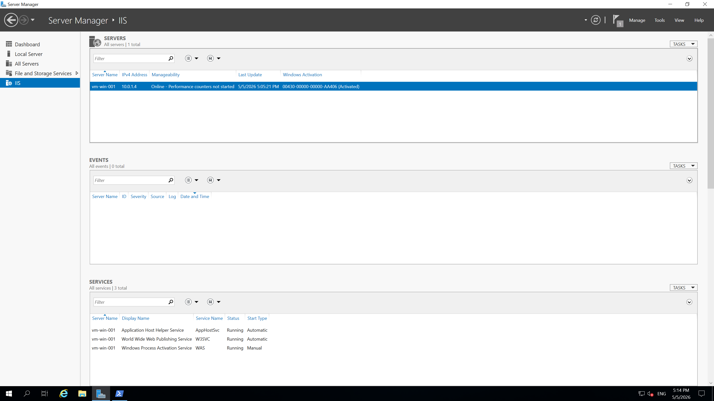
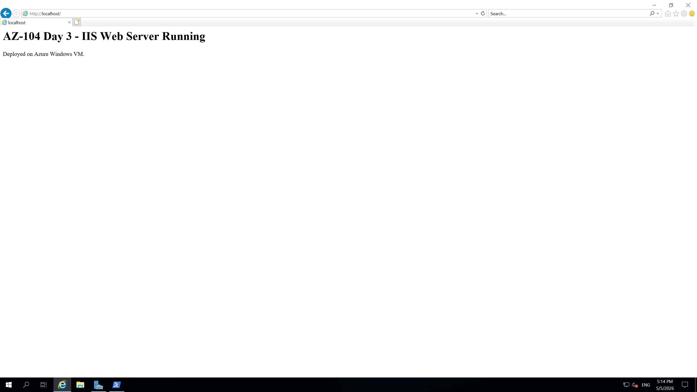
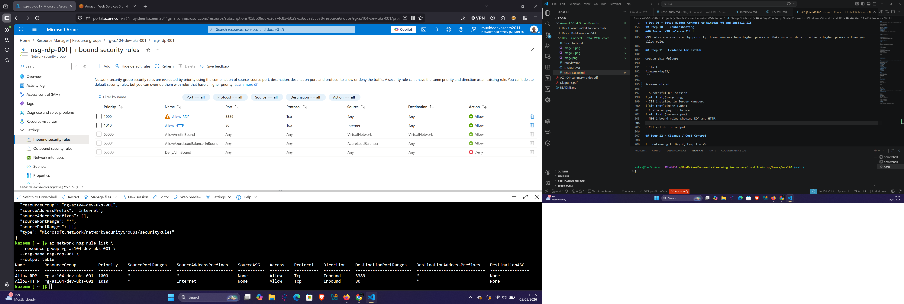

# Day 03 – Setup Guide: Connect to Windows VM and Install IIS

## Objective

Connect to the Windows VM created in Day 2, install IIS, allow HTTP traffic, and validate browser access to the web server.

## Prerequisites

- Completed Day 2
- Windows VM running: `vm-win-001`
- Azure CLI or Azure Cloud Shell access
- RDP client installed
- Admin username and password from Day 2

## Resource Names Used

| Resource | Name |
|---|---|
| Resource Group | `rg-az104-dev-uks-001` |
| Virtual Machine | `vm-win-001` |
| Network Security Group | `nsg-rdp-001` |
| HTTP Rule | `Allow-HTTP` |

## Step 1 – Confirm VM Status

```bash
az vm get-instance-view \
  --resource-group rg-az104-dev-uks-001 \
  --name vm-win-001 \
  --query "instanceView.statuses[?starts_with(code, 'PowerState/')].displayStatus" \
  --output table
```

If the VM is stopped, start it:

```bash
az vm start \
  --resource-group rg-az104-dev-uks-001 \
  --name vm-win-001
```

## Step 2 – Get the VM Public IP Address

```bash
az vm list-ip-addresses \
  --resource-group rg-az104-dev-uks-001 \
  --name vm-win-001 \
  --query "[].virtualMachine.network.publicIpAddresses[].ipAddress" \
  --output tsv
```

Copy the public IP address.

## Step 3 – Connect to the VM Using RDP

### Windows

Open Remote Desktop Connection:

```text
mstsc
```

Enter the public IP address and sign in with the VM admin credentials.

### macOS

Use Microsoft Remote Desktop from the App Store.

### Linux

Use Remmina or another RDP client.

## Step 4 – Install IIS Using Server Manager

Inside the Windows VM:

1. Open **Server Manager**.
2. Select **Add roles and features**.
3. Choose **Role-based or feature-based installation**.
4. Select the local server.
5. Select **Web Server (IIS)**.
6. Accept required features.
7. Click **Install**.
8. Wait until installation completes.

## Step 5 – Install IIS Using PowerShell Alternative

You can also install IIS using PowerShell inside the VM:

```powershell
Install-WindowsFeature -name Web-Server -IncludeManagementTools
```

Validate IIS service:

```powershell
Get-WindowsFeature Web-Server
```

## Step 6 – Create a Test Web Page

Inside the VM, open PowerShell as Administrator:

```powershell
Set-Content -Path "C:\inetpub\wwwroot\index.html" -Value "<h1>AZ-104 Day 3 - IIS Web Server Running</h1><p>Deployed on Azure Windows VM.</p>"
```

## Step 7 – Allow HTTP Traffic in the NSG

Create an inbound NSG rule for TCP 80:

```bash
az network nsg rule create \
  --resource-group rg-az104-dev-uks-001 \
  --nsg-name nsg-rdp-001 \
  --name Allow-HTTP \
  --protocol Tcp \
  --priority 1010 \
  --destination-port-range 80 \
  --access Allow \
  --direction Inbound \
  --source-address-prefixes Internet \
  --destination-address-prefixes "*"
```

## Step 8 – Validate NSG Rules

```bash
az network nsg rule list \
  --resource-group rg-az104-dev-uks-001 \
  --nsg-name nsg-rdp-001 \
  --output table
```

Confirm that both rules exist:

- `Allow-RDP`
- `Allow-HTTP`

## Step 9 – Test the Web Server

Open a browser on your local machine:

```text
http://<VM-Public-IP>
```

Expected result:

```text
AZ-104 Day 3 - IIS Web Server Running
Deployed on Azure Windows VM.
```

## Step 10 – Troubleshooting

### Issue: Browser cannot reach website

Check:

1. IIS is installed.
2. VM is running.
3. NSG allows TCP 80.
4. Windows Firewall allows HTTP.
5. Public IP is correct.

Inside VM, check IIS locally:

```powershell
Invoke-WebRequest http://localhost
```

### Issue: RDP fails

Check:

1. VM is running.
2. Public IP exists.
3. NSG allows TCP 3389.
4. Credentials are correct.

### Issue: NSG rule conflict

NSG rules are evaluated by priority. Lower numbers have higher priority. Make sure no deny rule has a higher priority than your allow rule.

## Step 11 – Evidence for GitHub

Create this folder:

```text
/images/day03/
```

Screenshots of:

- Successful RDP session.

- IIS installed in Server Manager.

- Custom webpage in browser.

- NSG inbound rules showing RDP and HTTP.


## Step 12 – Cleanup / Cost Control

If continuing to Day 4, keep the VM.

To reduce cost when finished practising:

```bash
az vm deallocate \
  --resource-group rg-az104-dev-uks-001 \
  --name vm-win-001
```

Do not delete the resource group if you are continuing the 30-day project.
